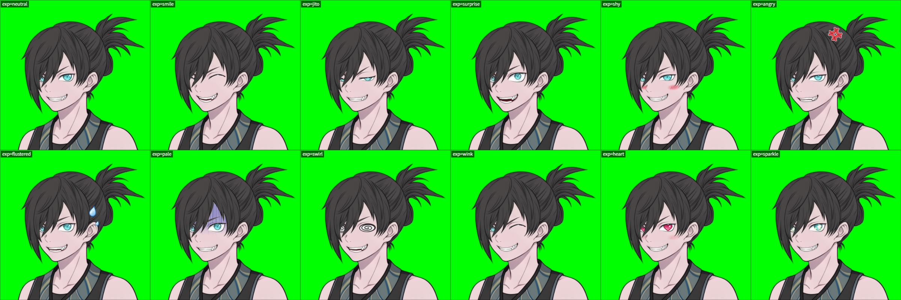
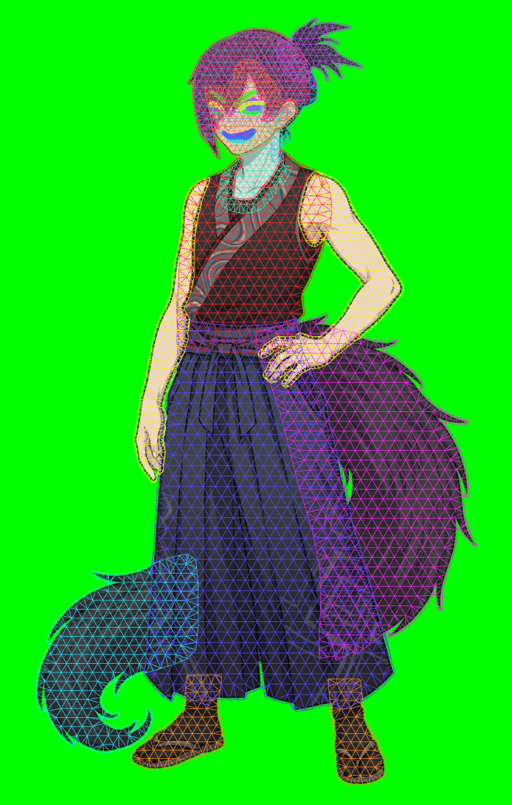
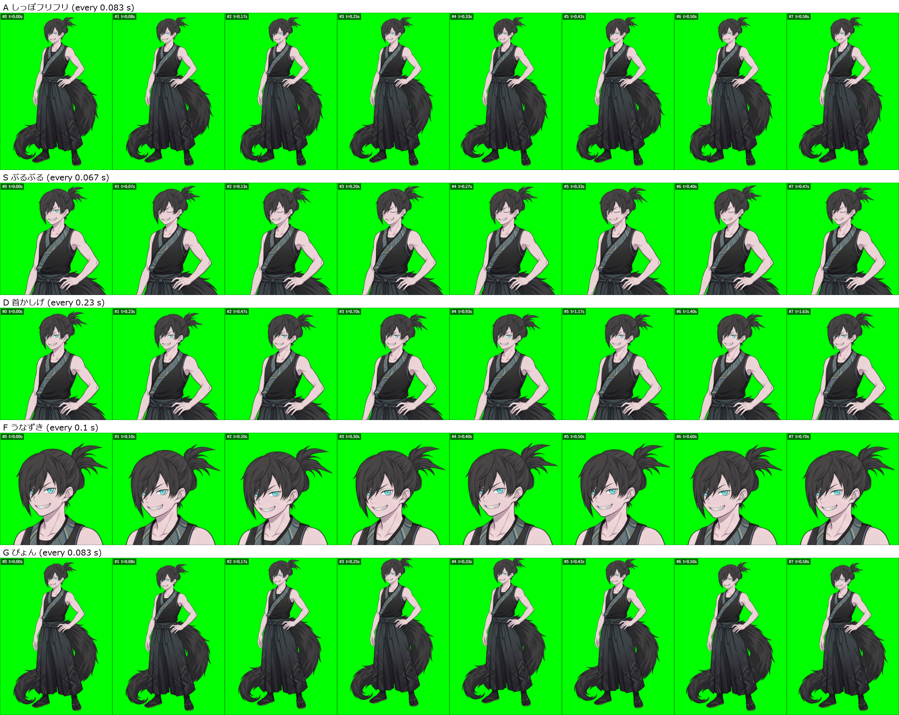

# vtuber-rig

キャラクターの設定シート 1 枚から作った、ブラウザで動く Live2D 風の VTuber 立ち絵です。

**▶ 公開ページ: https://riku1128-tong.github.io/vtuber-rig/**

## 特徴

- 立ち絵を 25 パーツに分割し、パーツごとに三角形のアートメッシュを付けています（頂点 約 5,000・三角形 約 8,000）。
- 顔の向き（左右・上下・傾き）、体の傾き、呼吸、まばたき、目線、口パクのパラメータで、パーツが別々に変形します。
- 前髪・ポニーテール・尻尾 2 本・袴・腕は、物理演算で揺れます。
- Webカメラの顔トラッキング（MediaPipe Face Landmarker）、マウス追従、マイク口パク、待機モーションに対応しています。
- 表情を 12 種類、キーで切り替えられます。
- 顔トラッキング中は、笑う・眉を上げる・眉を寄せるなどの表情に合わせて、表情が自動で付きます（自動表情）。
- しっぽフリフリ・首かしげなどのアクションをキーで再生できます。しゃべったり笑ったりすると、尻尾が自動で揺れます。
- 背景・構図・各種設定・キャリブレーションはブラウザに保存され、次に開いたときに復元されます。
- 「アートメッシュ表示」をオンにすると、メッシュを確認できます。

## 使い方

公開ページを Chrome などで開き、右の設定パネルから操作します。

| キー | 動作 |
|---|---|
| 0 | 通常 |
| 1〜9 | 笑顔 / ジト目 / 驚き / 照れ / 怒り / 焦り / 青ざめ / ぐるぐる目 / ウインク |
| Q / W | ハート目 / キラキラ目 |
| A / S / D / F / G | しっぽフリフリ / ぶるぶる / 首かしげ / うなずき / ぴょん |
| H | 設定パネルの表示・非表示 |

同じ表情キーをもう一度押すと、通常に戻ります。アクションは重ねて再生できます。

### 自動表情

設定パネルの「自動表情」でオン/オフと感度を変えられます。驚き・怒り・照れは個別にオフにできます。キーで選んだ表情（通常以外）のほうが優先されます。トラッキング開始直後に自動でキャリブレーションするので、最初は普段の顔でカメラを見てください。

### URL パラメータ

- `?bg=green|transparent|blue|%23rrggbb`：背景色（既定はグリーン）
- `?ui=0`：設定パネルを隠す
- `?view=full|upper|face`：構図（全身 / 上半身 / 顔アップ）
- `?exp=smile` など：最初の表情
- `?track=1`：開いたらすぐカメラのトラッキングを開始
- `?zoom=` / `?pan=x,y`：ズームと位置
- `?autoexp=0|1`、`?expsens=`、`?autodet=surprise,angry,shy`：自動表情のオン/オフ、感度、使う検出
- `?autotail=0|1`：しっぽ自動
- `?mirror=` / `?mouse=` / `?idle=` / `?physics=`（`0|1`）：ミラー表示 / マウス追従 / 待機モーション / 物理演算

URL で指定した項目は、保存された設定より優先されます（保存した値は書き換えません）。「OBS 用 URL をコピー」で、今の設定を含んだ URL をコピーできます。

例: `https://riku1128-tong.github.io/vtuber-rig/?bg=transparent&ui=0&view=upper`

### OBS で使う

- **顔トラッキングを使う場合**：ブラウザで開いてトラッキングを開始し、OBS のウィンドウキャプチャで取り込みます。緑背景をクロマキーで抜いてください。
- **ブラウザソースで使う場合**：上の例のように `bg=transparent&ui=0` を付けた URL を指定します。OBS のブラウザソースは通常カメラを使えないので、待機モーションとマウス追従だけになります。

## ファイル

| ファイル | 内容 |
|---|---|
| `index.html` | 立ち絵ビューア本体。モデル・テクスチャ・プログラムを全部埋め込んだ 1 ファイルで、ダウンロードしてローカルでも動きます |
| `parts.psd` | パーツ分割済みの PSD（Live2D Cubism Editor などに読み込めます）。表情用の重ね絵は非表示レイヤーで入っています |
| `parts_clipbaked.psd` | 虹彩のクリッピングを切り抜き済みにした PSD（クリッピングを扱えないソフト向け） |
| `parts/` | パーツごとの PNG と配置情報 `layout.json`（`ov` から始まるものは表情用の重ね絵） |

## 注意

- これは Live2D Cubism の形式（.moc3）ではなく、WebGL で動く独自のリグです。Live2D モデルとして使いたい場合は、`parts.psd` を Cubism Editor に読み込んで組み直してください。
- 顔トラッキングの実行時に、MediaPipe のライブラリとモデルを jsDelivr と Google のサーバーから読み込みます。カメラ映像はブラウザの中だけで処理され、外部には送信されません。
